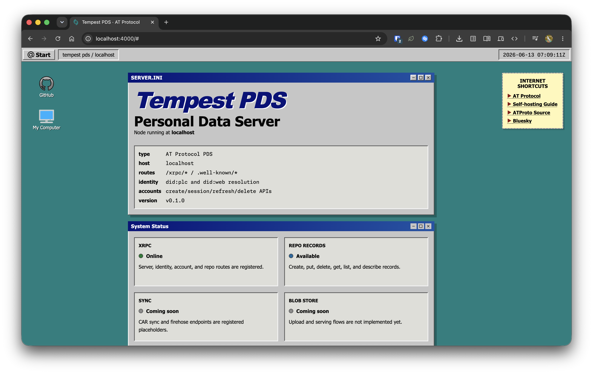
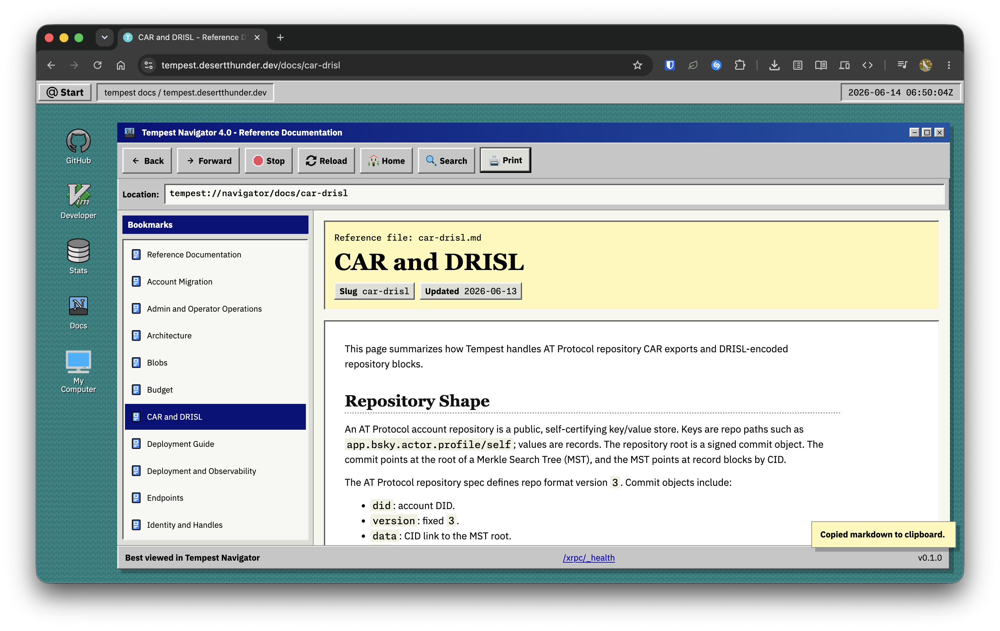
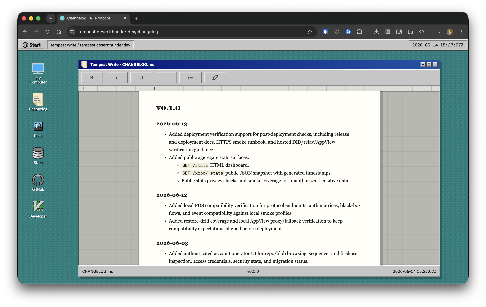

# Tempest

Tempest is a self-hostable AT Protocol Personal Data Server ([PDS](https://atproto.com/guides/self-hosting))
built with Elixir and Phoenix.

It stores accounts, repos, records, blobs, sessions, identity state, OAuth state,
migration state, and operator backup metadata.



## Features

- Hosts AT Protocol accounts with local SQLite-backed repo storage.
- Implements the core `com.atproto.server`, `identity`, `repo`, and `sync`
  PDS XRPC surfaces.
- Serves [CAR](https://atproto.com/specs/repository#car-file-serialization) exports,
  blobs, repo status, and a live/backfilled firehose.
- Supports local filesystem blobs and S3-compatible blob/backup storage.
- Provides browser account tools under `/account`.
- Provides browser admin/operator tools under `/admin`.
- Supports account migration, repo import/export, backup verification, app
  passwords, [DPoP](https://atproto.com/guides/oauth-patterns#understanding-d-po-p)/OAuth
  primitives, and compatibility-focused AppView fallbacks.

Tempest is a PDS, not an AppView. Known PDS-owned methods are handled locally;
unknown `app.bsky.*` and `chat.bsky.*` methods can proxy to an upstream AppView
when configured.

## Quick Start

```bash
mix setup
mix phx.server
```

The development server runs at `http://localhost:4000`.

For local configuration, disposable data directories, admin bootstrap, smoke
tests, and reset commands, see [DEVELOPMENT.md](./DEVELOPMENT.md).

## Running It

Release and reverse-proxy examples live in [`conf/`](./conf/):

- [`conf/Dockerfile`](./conf/Dockerfile) builds a Phoenix release image.
- [`conf/docker-compose.yml`](./conf/docker-compose.yml) runs Tempest locally.
- [`conf/Caddyfile`](./conf/Caddyfile) fronts Tempest with Caddy for HTTPS.
- [`conf/.env.example`](./conf/.env.example) is the production env template.

Production-like federation checks need a public HTTPS hostname with DNS pointing
at the host.

Deployment details live in [Deployment Guide](./docs/reference/deployment.md).

## Configuration

The main runtime settings are:

| Variable                     | Purpose                                                 |
| ---------------------------- | ------------------------------------------------------- |
| `TEMPEST_HOSTNAME`           | Bare hostname served by this PDS.                       |
| `TEMPEST_PUBLIC_URL`         | Public origin, including scheme.                        |
| `TEMPEST_DATA_DIR`           | Durable SQLite, blob, temp, and backup directory.       |
| `TEMPEST_HOSTED_DID_METHOD`  | Hosted DID method, currently `plc` or `web`.            |
| `TEMPEST_CRAWLERS`           | Comma-separated relay crawler URLs.                     |
| `TEMPEST_APPVIEW_URL`        | Optional upstream AppView proxy target.                 |
| `TEMPEST_ADMIN_DID`          | DID allowed to use the browser admin UI.                |
| `TEMPEST_ADMIN_TOKEN_HASH`   | Optional Argon2 hash for admin bearer-token automation. |
| `TEMPEST_BLOB_STORE`         | `local` by default, or `s3` with S3 env vars.           |
| `TEMPEST_BACKUP_STORE`       | `local` by default, or `s3` with S3 env vars.           |
| `TEMPEST_EMAIL_PROVIDER`     | `local` by default, or `smtp`, or `resend`.             |
| `TEMPEST_RESEND_API_KEY`     | Resend API key (required when provider is `resend`).    |
| `TEMPEST_EMAIL_FROM_NAME`    | Sender display name for security email.                 |
| `TEMPEST_EMAIL_FROM_ADDRESS` | Verified sender address for security email.             |

## Storage and Backups

Tempest keeps the account database, sequencer database, per-account repo
databases, local blobs, temp files, and backups under `TEMPEST_DATA_DIR`.

Local storage is the default. S3-compatible storage is available for blobs and
operator backups through the `TEMPEST_BLOB_*` and `TEMPEST_BACKUP_*` env groups.
The admin UI exposes storage and backup status under `/admin/storage` and
`/admin/backups`.

## Admin and Account UI

Account operator & admin routes are at `/account` & `/admin` respectively.

Browser admin access is anchored to `TEMPEST_ADMIN_DID`

## Endpoint Checklist

The canonical, coverage-aware matrix is
[`docs/reference/pds-compatibility.md`](./docs/reference/pds-compatibility.md).
The checklist below is a README-sized status snapshot. Operational/admin routes
are listed separately because they are Tempest service routes, not AT Protocol
Lexicon methods.

### Server and Account

- [x] `com.atproto.server.describeServer`
- [x] `com.atproto.server.createAccount`
- [x] `com.atproto.server.createSession`
- [x] `com.atproto.server.refreshSession`
- [x] `com.atproto.server.deleteSession`
- [x] `com.atproto.server.getSession`
- [x] `com.atproto.server.createAppPassword`
- [x] `com.atproto.server.listAppPasswords`
- [x] `com.atproto.server.revokeAppPassword`
- [x] `com.atproto.server.getServiceAuth`
- [x] `com.atproto.server.checkAccountStatus`
- [x] `com.atproto.server.activateAccount`
- [x] `com.atproto.server.deactivateAccount`
- [x] `com.atproto.server.requestAccountDelete`
- [x] `com.atproto.server.deleteAccount`
- [x] `com.atproto.server.reserveSigningKey`
- [~] `com.atproto.server.requestPasswordReset`
- [~] `com.atproto.server.resetPassword`
- [~] `com.atproto.server.confirmEmail`
- [~] `com.atproto.server.requestEmailConfirmation`
- [~] `com.atproto.server.requestEmailUpdate`
- [~] `com.atproto.server.updateEmail`

### Identity

- [x] `com.atproto.identity.resolveHandle`
- [x] `com.atproto.identity.updateHandle`
- [x] `com.atproto.identity.getRecommendedDidCredentials`
- [x] `com.atproto.identity.requestPlcOperationSignature`
- [x] `com.atproto.identity.signPlcOperation`
- [x] `com.atproto.identity.submitPlcOperation`

### Repository

- [x] `com.atproto.repo.createRecord`
- [x] `com.atproto.repo.putRecord`
- [x] `com.atproto.repo.deleteRecord`
- [x] `com.atproto.repo.applyWrites`
- [x] `com.atproto.repo.getRecord`
- [x] `com.atproto.repo.listRecords`
- [x] `com.atproto.repo.describeRepo`
- [x] `com.atproto.repo.uploadBlob`
- [x] `com.atproto.repo.listMissingBlobs`
- [x] `com.atproto.repo.importRepo`

### Sync

- [x] `com.atproto.sync.getRepo`
- [x] `com.atproto.sync.getBlocks`
- [x] `com.atproto.sync.getRecord`
- [x] `com.atproto.sync.getLatestCommit`
- [x] `com.atproto.sync.getRepoStatus`
- [x] `com.atproto.sync.listRepos`
- [x] `com.atproto.sync.listBlobs`
- [x] `com.atproto.sync.getBlob`
- [x] `com.atproto.sync.requestCrawl`
- [x] `com.atproto.sync.subscribeRepos`
- [ ] `com.atproto.sync.notifyOfUpdate`

### AppView Compatibility

- [x] `app.bsky.actor.getPreferences`
- [x] `app.bsky.actor.putPreferences`
- [x] Unknown `app.bsky.*` / `chat.bsky.*` proxy fallback when configured

### Operational and Admin

- [x] `GET /xrpc/_health`
- [x] `GET /xrpc/_stats`
- [x] `GET /xrpc/_admin/status`
- [x] `GET /.well-known/atproto-did`
- [x] `GET /.well-known/did.json`
- [x] `GET /.well-known/oauth-protected-resource`
- [x] `GET /.well-known/oauth-authorization-server`
- [x] `GET /oauth/jwks`
- [x] Browser account control panel under `/account/*`
- [x] Browser admin/operator control panel under `/admin/*`

## Verification

Tempest uses executable [Hurl](https://hurl.dev) scripts as black-box PDS checks.
The smoke suite exercises the same HTTP and WebSocket surface that clients, relays,
and operators use, namely account creation, auth, repo writes, CAR reads, blob lifecycle,
firehose events, metadata, proxy fallback, and admin protection.

## Documentation

- [Development](./DEVELOPMENT.md)
- [Deployment](./docs/reference/deployment.md)
- [PDS compatibility](./docs/reference/pds-compatibility.md)
- [Architecture](./docs/reference/architecture.md)
- [Admin operations](./docs/reference/admin-operations.md)
- [Interop testing](./docs/reference/interop-testing.md)
- [Storage and SQLite](./docs/reference/storage-sqlite.md)
- [Sync and firehose](./docs/reference/sync-firehose.md)

The deployed docs viewer is available at
<https://tempest.desertthunder.dev/docs>.



The changelog is available in [CHANGELOG.md](./CHANGELOG.md) and at
<https://tempest.desertthunder.dev/changelog>.



## References

- [Official TypeScript PDS](https://github.com/bluesky-social/atproto/tree/main/packages/pds)
- [Cocoon](https://github.com/haileyok/cocoon), a PDS written in Go
- [Tranquil](https://tangled.org/tranquil.farm/tranquil-pds), a PDS written in Rust
- [Pegasus](https://tangled.org/futur.blue/pegasus), a PDS written in OCaml
- [ZDS](https://tangled.org/zat.dev/zds), a PDS written in Zig
